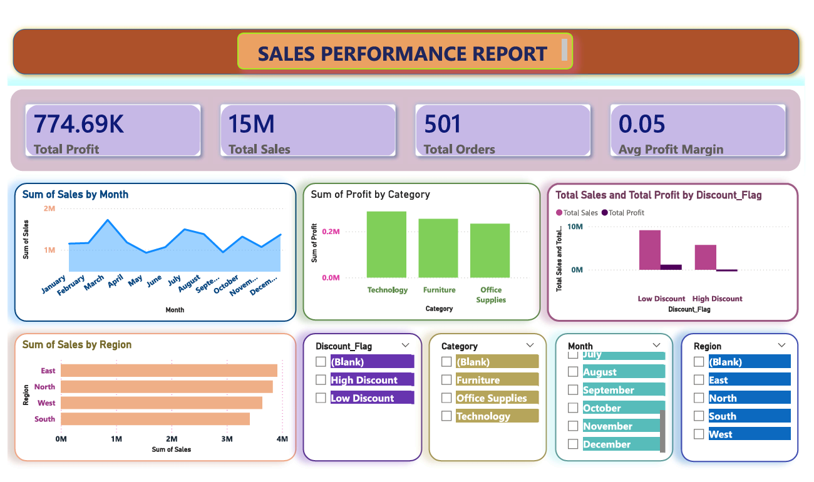

# Sales Performance & Discount Impact Dashboard | Power BI

## 🔍 Project Overview
This project presents an interactive **Sales Performance & Discount Impact Dashboard** built using **Power BI**.  
The objective is to analyze overall sales performance, profitability, regional trends, category-wise profit, and the impact of discounts on business outcomes.

The dashboard helps stakeholders quickly identify:
- Business performance through KPIs
- Monthly sales trends
- Profitable and loss-making categories
- Regional contribution to sales
- How discounts affect profit

---

## 📊 Dashboard Preview



---

## 🧰 Tools & Technologies
- **Power BI Desktop**
- **Microsoft Excel**
- **DAX (Data Analysis Expressions)**

---

## 📂 Dataset Information
- Type: Retail Sales Dataset (Simulated)
- Records: ~500+ orders
- Key fields:
  - Order_ID
  - Order_Date
  - Region
  - Category
  - Sales
  - Profit
  - Discount
  - Discount_Flag
  - Profit_Margin

---

## 📌 Key KPIs
- **Total Sales**
- **Total Profit**
- **Total Orders**
- **Average Profit Margin**

---

## 📈 Visualizations Included
- **Monthly Sales Trend** – Line Chart
- **Sales by Region** – Bar Chart
- **Profit by Category** – Clustered Column Chart
- **Discount Impact (Sales vs Profit)** – Clustered Column Chart

---

## 🎛️ Interactivity
The dashboard includes interactive slicers:
- **Region**
- **Category**

These slicers dynamically filter all visuals and KPIs for deeper analysis.

---

## 🧮 DAX Measures Used
```
DAX
Total Sales = SUM(Sales_data[Sales])

Total Profit = SUM(Sales_data[Profit])

Total Orders = DISTINCTCOUNT(Sales_data[Order_ID])

Avg Profit Margin = DIVIDE([Total Profit], [Total Sales])
```
---
##💡 Key Business Insights

-High discount orders generate higher sales but significantly reduce profitability
-Low discount orders maintain healthier profit margins
-Technology category contributes the highest profit
-Sales show monthly fluctuations indicating seasonality
-Regional performance varies, highlighting focus areas for growth

---

##📁 Repository Structure
```
Sales-Performance-Discount-Impact-Dashboard-Power-BI
│
├── POWER BI
│   └── Sales_Performance_Dashboard.pbix
│
├── EXCEL
│   └── Excel_Reports.xlsx
│
├── IMAGES
│   └── dashboard_preview.png
│
└── README.md
```
---

##🚀 How to Use
-Download the .pbix file from the POWER BI folder
-Open it in Power BI Desktop
-Use slicers to explore insights by region and category

---

##📈 Project Outcome
-This project demonstrates:
-End-to-end data analysis workflow
-Strong Power BI visualization skills
-Effective use of DAX measures
-Business-focused analytical thinking
